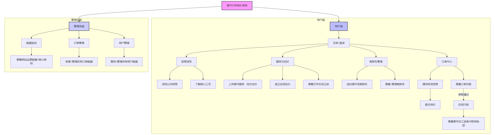
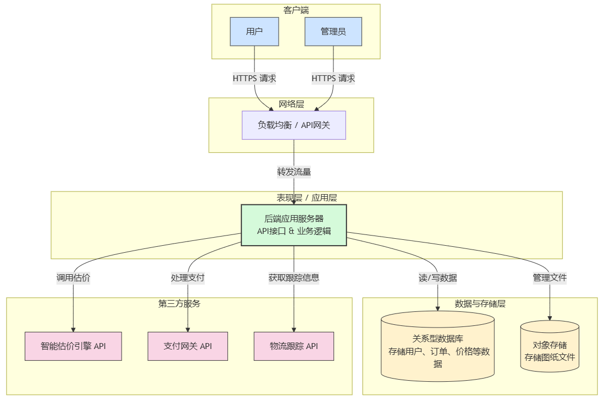
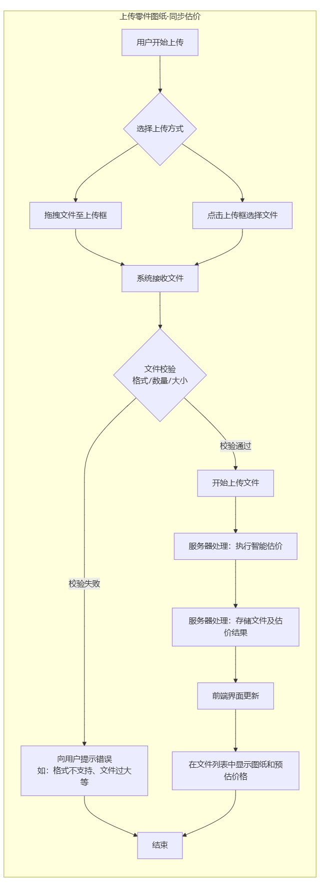
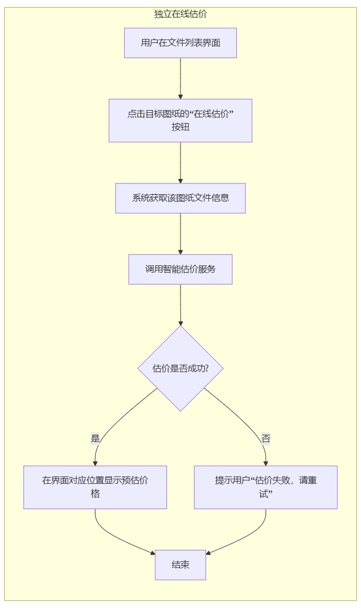
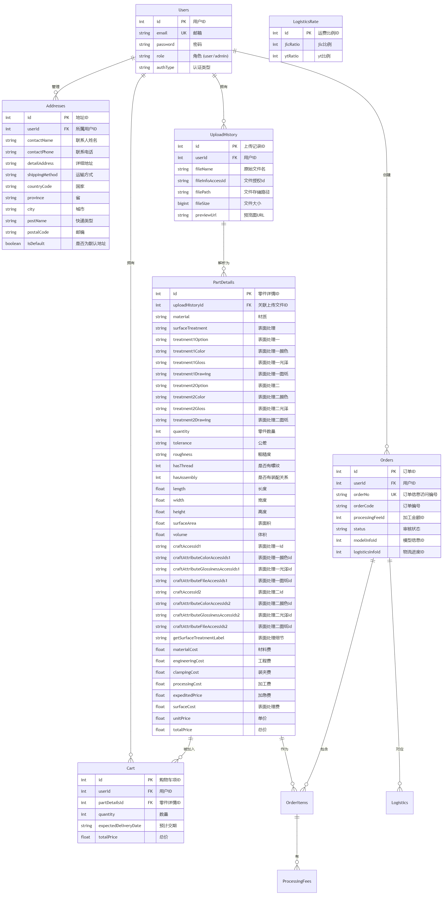

# 引言

## 编写目的

## 背景

# 总体设计
## 系统总体结构设计
### 系统业务层次图

<strong>功能简介</strong>

本零件打样询价系统是一个连接用户与工厂的在线服务平台，旨在为用户提供从图纸上传、智能估价到订单跟踪的全流程服务，同时为管理者提供强大的后台监控功能。系统明确划分为用户端和管理员端：用户在完成注册登录后，即可进入专属界面，在此不仅可以浏览和了解公司的详细信息及核心工艺，还能便捷地进行核心业务操作。用户可通过两种方式获取报价：一是在上传零件图纸文件后，利用独立的“在线估价”功能即时评估成本；二是在上传图纸的同时直接触发估价，系统会自动将图纸存入文件历史记录，方便用户随时回顾与管理。对于暂未决定下单的零件，用户可将其便捷地添加至购物车进行暂存，以便后续统一处理；当用户对估价满意并决定下单时，需先填写详尽的个人信息，包括收货地址和联系电话，随后便可提交询价单等待系统审核。用户可以访问订单列表，清晰地查看所有已提交询价的订单状态，包括价格信息的审核进度，实时追踪询价的审核状态，一旦审核通过，订单状态会更新并开放付款入口。审核通过的订单将激活付款按钮，用户可直接在线完成支付。用户完成在线支付后，工厂即刻启动打样流程，同时用户可以在订单详情页实时追踪零件打样的每一个生产环节进度和物流轨迹。对于管理员而言，系统提供了功能强大的后台管理界面，使其能够宏观调控和监控平台运营状况，具体包括：查看网站的整体运营数据和核心指标，审查和管理所有的订单数据，以及查询与管理平台上的全部用户数据，从而确保整个业务流程的顺畅与高效。

### 统架构设计说明

## 系统功能设计
### 用户端

#### 上传零件图纸·同步估价
##### 功能描述
用户将图纸文件拖到上传框或点击上传框上传图纸文件，文件上传完毕后进行估价并存储到文件列表中
##### 接口设计
输入操作：支持3D (必须) 格式： step, stp ; 支持2D格式： dwg, dxf, pdf ，可压缩包（ zip、rar ）直接上传；建议您同时上传3D（必须）和2D图纸，同一款零件3D和2D图纸名称需要一致；单次上传文件 ≤20 个，单个文件大小 <100M
输出效果：文件存储到文件列表，并显示零件的预估价格
##### 功能流程图

#### 独立在线估价
##### 功能描述
点击文件列表的某一个零件图纸的在线估价按钮进行估价
##### 接口设计
输入操作：文件列表中存储的某一图纸文件
输出效果：显示零件的预估价格
##### 功能流程图

#### 查看文件历史记录
##### 功能描述

##### 接口设计
##### 功能流程图

#### 添加零件至购物车
##### 功能描述
##### 接口设计
##### 功能流程图

#### 查看/管理购物车
##### 功能描述
##### 接口设计
##### 功能流程图

#### 填写收货信息
##### 功能描述
##### 接口设计
##### 功能流程图

#### 在线付款
##### 功能描述
##### 接口设计
##### 功能流程图

#### 查看零件加工进度与物流轨迹
##### 功能描述
##### 接口设计
##### 功能流程图

### 管理员端

## 数据库设计
